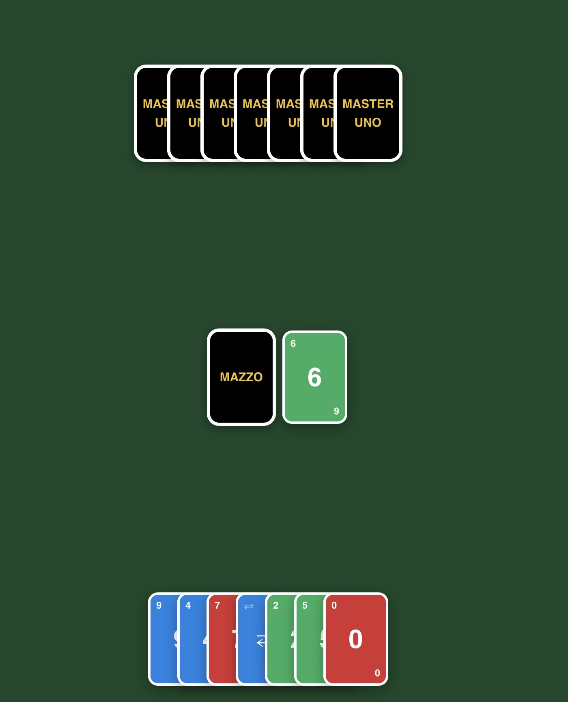

# MasterUno
MasterUno è una versione cyber e potenziata del classico UNO, con stile arcade neon e meccaniche aggiuntive che rendono ogni partita più strategica e caotica.

Il gioco include:

- Modalità contro bot con IA base (giocate automatiche rapide)
- Multiplayer online via PeerJS con codice stanza
- Sistema di gestione turni in tempo reale
- Regole UNO complete: +2, +4, skip, reverse, wild
- Blocco “UNO!” obbligatorio con penalità
- Sistema draw stack cumulativo (+2 / +4)
- Selettore colore per carte wild
- UI dinamica con feedback visivi e animazioni
- Sistema confetti per vittoria
- Schermata finale con restart o exit

È collegato alla repository centrale MasterGames (https://mastersabba.github.io/MasterSabba/), che contiene tutti i minigiochi della serie Master.

